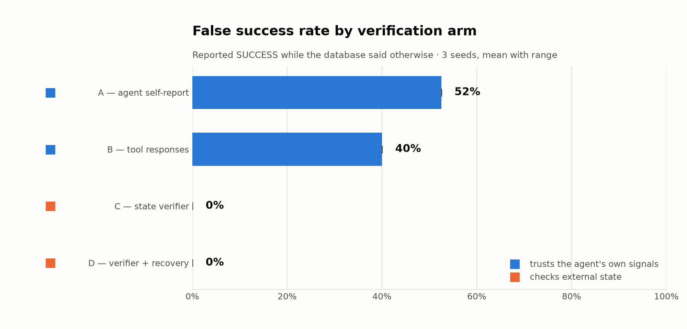
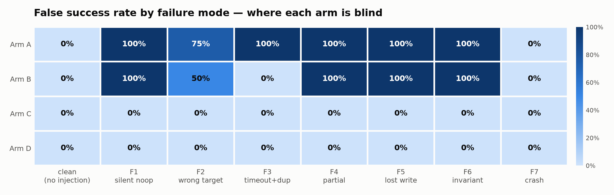

# AgentTruthLab

**When an AI agent reports "task completed" and its tools return `200 OK`, is the external system actually in the intended state?**

<picture>
  <source media="(prefers-color-scheme: dark)" srcset="results/headline_false_success_rate_dark.png">
  
</picture>

Across 120 episodes of payment operations under silent tool failures, the agent's own
completion claim was wrong **52%** of the time, and trusting HTTP 200 responses was wrong
**40%** of the time. Both signals are *observability* — they report what the actor
believed and what the API said. Neither reads the database.

## The thesis: observability is not assurance

An agent that issues refunds, retries charges, and closes settlements produces two kinds of
evidence about its own work: what it says it did, and what its tools said back. Both are
generated by the same execution path that performed the action, so both fail exactly when
the action fails. A tool that silently no-ops still returns a well-formed success envelope;
an agent reading that envelope reports success in good faith. Neither signal is lying in
any interesting sense — they are simply not measurements of the outside world.

Assurance is different in kind, not degree: it opens an independent connection to the
system of record and asks whether the rows that were supposed to change actually changed.
The deliberate design constraint here is that **the assurance layer contains no LLM** — it
is a deterministic evaluator of declarative state assertions plus business invariants,
because verification logic must be cheaper and more trustworthy than the thing it audits.
In this experiment it is: the verifier costs **0 tokens, ~8 ms, and ~20 database reads**
per episode, against ~4 seconds and ~4,600 tokens for the agent turn it checks.

The payoff is that assurance composes into repair. Once you can tell what actually
happened, a rule-based playbook can diagnose the divergence and fix most of it: **78% of
damaged episodes recovered automatically**, with the remainder escalated as structured
incidents, and **zero cases where recovery left the system worse than it found it** — a
guarantee enforced by comparing state before and after every repair and discarding the
whole repair if it regressed.

## Results

| Arm | Trusts | False success | False failure |
|-----|--------|---------------|---------------|
| **A** — agent self-report | the agent's own claim | **52.5%** | 0.0% |
| **B** — tool responses | `ok: true` / HTTP 200 | **40.0%** | 7.5% |
| **C** — state verifier | the database | 0.0%\* | 0.0% |
| **D** — verifier + recovery | the database, then repairs | 0.0%\* | 5.0% |

<picture>
  <source media="(prefers-color-scheme: dark)" srcset="results/heatmap_arm_by_mode_dark.png">
  
</picture>

\* **Arm C's zero is by construction, not by measurement** — the verifier evaluates the
mission spec, and that spec *is* the ground truth, so it cannot disagree with itself. The
result in this experiment is the *gap* between A/B and reality; C's honest cost is its
indeterminate rate (0%) and its latency. The sensitivity analysis below gives the one
non-circular number available for C. See [findings.md](findings.md) for the full statement
of what these numbers do and do not show.

### Does the headline depend on how "correct state" is defined?

Ground truth could reasonably be drawn two ways: **frame-scoped** (the mission's assertions
plus global invariants) or **strict** (the same, plus: any write outside the mission's
declared frame is damage). Re-scoring the same recorded episodes against both — offline,
with no API calls — gives:

| Arm | Frame-scoped | Strict |
|-----|--------------|--------|
| A — agent self-report | 52.5% | **55.0%** |
| B — tool responses | 40.0% | **42.5%** |
| C — verifier (frame-scoped) | 0.0% | **2.5%** |

The headline gap is **robust to the choice**: A and B move by ~2 points. Three episodes
(2.5%) flip from VERIFIED to FAILED — all of them `m22_cancel_refund_f2_wrong`, where the
injected wrong-target write cancelled an unrelated order the mission spec never mentions.
That last row is the only non-circular measurement of the verifier in this experiment:
Arm C is frame-scoped, so judging it against *strict* truth uses an evaluator that differs
from the truth judging it, and it puts a real number on what the verifier misses.

```bash
atl-rescore    # regenerates this table from stored runs, no API key needed
```

Two findings worth calling out. **F7 (process crash after the side effect commits) is the
one mode where the agent does not overclaim** — it never gets to speak, so Arm A reports
INDETERMINATE rather than success; the damage is real but the lie is not. And where **Arm B
scores better than Arm A** (F2, F3), it is never because a response revealed the true state:
on F3 the injected timeout is itself a non-200, and the single F2 case where B dissents is a
charge that was diverted onto an underfunded customer and declined on its own.

## Reproduce it

```bash
git clone https://github.com/MEGA-M1ND/agent-truth-lab && cd agent-truth-lab
python -m venv .venv && .venv/bin/pip install -e ".[dev]"   # Windows: .venv\Scripts\pip
export ANTHROPIC_API_KEY=sk-ant-...
atl-run --report
```

That runs 40 missions × 3 seeds, evaluates all four arms, and writes the charts and
`findings.md`. It prints a cost estimate and waits for nothing — the full run costs about
**$0.69** and takes ~8 minutes on `claude-haiku-4-5` (the model is configurable in
`config/experiment.yaml`; the agent is deliberately a cheap model because what is being
measured is the truthfulness of success signals, not the agent's competence).

```bash
atl-run --estimate-only        # print the cost estimate and exit
atl-run --seeds 42 --limit 5   # a quick partial run
atl-rescore                    # re-score stored runs offline (no API key)
pytest                         # 163 tests, no API key needed
```

## How it works

**Environment** — a fake payments SaaS in SQLite (customers, orders, refunds,
subscriptions, charges, settlements, emails). All money is integer paise. Seeded
deterministically: the same seed produces a byte-identical database.

**Tools** — five tools the agent can call: `issue_refund`, `retry_subscription_charge`,
`create_settlement`, `update_order_status`, `send_customer_email`. Each returns
`{ok, http_status, data, error}`. `issue_refund` deliberately takes **no idempotency key**,
which is what makes duplicate refunds possible.

**Injection** — a layer the agent cannot see wraps the tools and applies one of seven
payment-flavored failure modes per mission: silent no-op, wrong target, timeout-then-duplicate,
partial completion, lost write, invariant violation, and crash-after-side-effect. Injection
uses no randomness at all — it is a pure function of database state and call order.
[`tests/test_injection.py`](tests/test_injection.py) proves, for every mode, both that the
response looks the way the spec says *and* that the database diverges from it exactly as
specified.

**Agent** — a raw Anthropic tool-calling loop. No LangChain, no LangGraph, no framework:
the experiment's credibility depends on nothing sitting between the agent and the tools.

**Arms** — A and B are pure post-hoc analyses of the recorded trajectory; C opens a separate
connection to a post-episode snapshot; D recovers on a *copy* of that snapshot so C's
measurement is never contaminated. All four judge the same recorded episodes.

## Layout

```
config/experiment.yaml              seeds, model, limits — the run is reproducible from this
src/agent_truth_lab/
  environment/   db.py  tools.py  invariants.py      the SaaS under test
  injection/     modes.py  injector.py               the 7 silent failure modes
  agent/         loop.py  missions.py                raw tool-calling loop + 40 missions
  verification/  verifier.py  arms.py  recovery.py   the four arms
  harness/       runner.py  metrics.py  report.py    execution, metrics, charts
                 rescore.py                          offline re-scoring / sensitivity
tests/                                               163 tests
results/                                             run JSON (gitignored) + charts (committed)
findings.md                                          numbers, auto-filled by the report step
experiment-log.md                                    design decisions, dated
```

## Caveats

- The LLM is the only stochastic component. Everything downstream of a recorded episode —
  injection, verification, metrics, recovery — is deterministic and replayable from the run
  JSON, which stores full trajectories and the post-episode database dump.
- Seeds vary the *data* (which orders, which amounts), not the mission *structure*, so the
  near-zero variance across seeds means the effect is robust to data variation — it is not
  evidence of a wider distribution having been sampled.
- Ground truth is scoped to each mission's declared assertions plus the global invariants,
  which gives the verifier a measurable blind spot of **2.5%** (quantified in the
  sensitivity table above). The project reports that number rather than quietly benefiting
  from the narrower definition.
- Because verification is pure and every episode's post-run database snapshot is stored,
  any run can be re-judged from disk under a different definition of correctness without
  calling the model again. `atl-rescore` is that path, and it is how the sensitivity table
  is produced.
