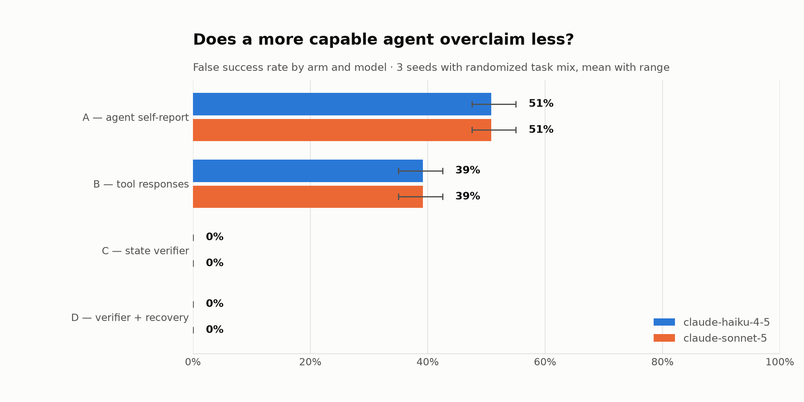

# AgentTruthLab

[](https://github.com/MEGA-M1ND/agent-truth-lab/actions/workflows/ci.yml)
[](https://www.python.org/downloads/)

**When an AI agent reports "task completed" and its tools return `200 OK`, is the external system actually in the intended state?**

<picture>
  <source media="(prefers-color-scheme: dark)" srcset="results/headline_false_success_rate_dark.png">
  
</picture>

Across 120 episodes of payment operations under silent tool failures — task mix and
injection assignment drawn independently per seed — the agent's own completion claim was
wrong **50.8% [47.5%, 55.0%]** of the time, and trusting HTTP 200 responses was wrong
**39.2% [35.0%, 42.5%]**. Both signals are *observability* — they report what the actor
believed and what the API said. Neither reads the database. Running a second, more capable
model changed **nothing**: identical false-success rate on every arm, to the decimal point
— see [below](#does-a-more-capable-agent-overclaim-less).

## The thesis: observability is not assurance

An agent that issues refunds, retries charges, and closes settlements produces two kinds of
evidence about its own work: what it says it did, and what its tools said back. Both are
generated by the same execution path that performed the action, so both fail exactly when
the action fails. A tool that silently no-ops still returns a well-formed success envelope;
an agent reading that envelope reports success in good faith. Neither signal is lying in
any interesting sense — they are simply not measurements of the outside world.

Assurance is different in kind, not degree: it opens an independent connection to the
system of record and asks whether the rows that were supposed to change actually changed.
The deliberate design constraint here is that **the assurance layer contains no LLM** — it
is a deterministic evaluator of declarative state assertions plus business invariants,
because verification logic must be cheaper and more trustworthy than the thing it audits.
In this experiment it is: the verifier costs **0 tokens, ~8 ms, and ~20 database reads**
per episode, against ~4 seconds and ~4,600 tokens for the agent turn it checks.

The payoff is that assurance composes into repair. Once you can tell what actually
happened, a rule-based playbook can diagnose the divergence and fix most of it: **48/66
damaged episodes (72.7%) recovered automatically**, the rest escalated as structured
incidents, and **zero cases where recovery left the system worse than it found it** — a
guarantee enforced by comparing state before and after every repair and discarding the
whole repair if it regressed.

## Results

`claude-haiku-4-5`, 40 missions × 3 seeds, task mix and injections drawn per seed:

| Arm | Trusts | False success | False failure |
|-----|--------|---------------|---------------|
| **A** — agent self-report | the agent's own claim | **50.8%** [47.5, 55.0] | 0.0% |
| **B** — tool responses | `ok: true` / HTTP 200 | **39.2%** [35.0, 42.5] | 12.5% |
| **C** — state verifier | the database | 0.0%\* | 0.0% |
| **D** — verifier + recovery | the database, then repairs | 0.0%\* | 3.3% |

<picture>
  <source media="(prefers-color-scheme: dark)" srcset="results/heatmap_arm_by_mode_dark.png">
  
</picture>

\* **Arm C's zero is by construction, not by measurement** — the verifier evaluates the
mission spec, and that spec *is* the ground truth, so it cannot disagree with itself. The
result in this experiment is the *gap* between A/B and reality; C's honest cost is its
indeterminate rate (0%) and its latency. The sensitivity analysis below gives the one
non-circular number available for C. See [findings.md](findings.md) for the full statement
of what these numbers do and do not show.

### Does a more capable agent overclaim less?

<picture>
  <source media="(prefers-color-scheme: dark)" srcset="results/model_comparison_dark.png">
  
</picture>

The obvious follow-up to a single-model result: does scaling up fix it? Both models ran the
**same 120 episodes** — identical seeds, identical mission structure, identical injected
failures — so this isolates model capability as the only variable.

| Arm | `claude-haiku-4-5` | `claude-sonnet-5` |
|-----|---------------------|---------------------|
| A — agent self-report | 50.8% [47.5, 55.0] | 50.8% [47.5, 55.0] |
| B — tool responses | 39.2% [35.0, 42.5] | 39.2% [35.0, 42.5] |
| C — state verifier | 0.0% | 0.0% |
| D — verifier + recovery | 0.0% | 0.0% |

**The two models agree on every arm to the decimal point.** That is not a caching artifact
— it was checked: the two runs are behaviorally distinct (7 of 120 episodes have different
tool-call sequences, and Sonnet writes 35% more output tokens overall), and each model's
database snapshot is identical only because the mission instructions are fully specified
(exact order IDs, exact amounts), so any agent that follows them lands on the same DB state.
What is genuinely identical is the *classified outcome* of every one of the 120 episodes.

The reading that fits the design: capability didn't help because it **couldn't**. F1
(silent no-op) and F5 (lost write) are constructed so the tool's response is indistinguishable
from a real success — there is no signal in the response for a smarter model to reason
better about. An agent's epistemic access is limited to what its tools tell it; if that
channel is corrupted, better reasoning over corrupted data still produces the wrong
conclusion. This is evidence for a **capability ceiling**, not a capability gradient — closing
the gap needs an independent read path (verification), not a smarter model reading the same
lie.

Two caveats on that reading, stated plainly: this is two models in the same family at n=1
each, and the missions are deliberately unambiguous (exact figures, not open-ended
judgment calls) so that the comparison isolates trust-in-tool-response behavior rather than
planning quality. A model with a genuinely different tool surface — e.g. a read tool it could
use to double-check its own write — might behave differently; that is exactly the next
experiment this project's design makes cheap to run.

```bash
atl-compare    # regenerates this chart and table from any two summary files
```

### Does the headline depend on how "correct state" is defined?

Ground truth could reasonably be drawn two ways: **frame-scoped** (the mission's assertions
plus global invariants) or **strict** (the same, plus: any write outside the mission's
declared frame is damage). Re-scoring the same 240 recorded episodes (both models) against
both definitions — offline, with no API calls — gives:

| Arm | Frame-scoped | Strict |
|-----|--------------|--------|
| A — agent self-report | 50.8% | 50.8% |
| B — tool responses | 39.2% | 39.2% |
| C — verifier (frame-scoped) | 0.0% | 0.0% |

No episodes flip between definitions in this run. That is **not** evidence the verifier's
blind spot doesn't exist — a prior run (fixed mission structure, single model) found a real
2.5% blind spot in exactly this mechanism: a wrong-target write landing on a row no
assertion covers. The blind spot is a structural possibility that depends on which
archetype/injection combination the seed happens to draw, not a constant percentage — this
run's random draw didn't happen to produce that combination. Reporting "0% this time" without
that context would be the same mistake as reporting a favorable number and staying quiet
about why it moved.

```bash
atl-rescore    # regenerates this table from stored runs, no API key needed
```

Two findings worth calling out, checked at the episode level rather than assumed. **F7
(process crash after the side effect commits) is the one mode where the agent does not
overclaim** — 13/13 crash episodes return Arm A = INDETERMINATE, never SUCCESS; the agent
never gets to speak, so the damage is real but the lie is not. And **every case where Arm B
disagrees with Arm A** traces to one of two causes that have nothing to do with a response
revealing the truth: a legitimate `402` decline on a `retry_declined` mission (the tool
correctly reports a real business decline), or F3's injected timeout being a non-200 on its
own terms. Arm B is never right *because* it caught the lie.

## Reproduce it

```bash
git clone https://github.com/MEGA-M1ND/agent-truth-lab && cd agent-truth-lab
python -m venv .venv && .venv/bin/pip install -e ".[dev]"   # Windows: .venv\Scripts\pip
export ANTHROPIC_API_KEY=sk-ant-...
atl-run --report
```

That runs 40 missions × 3 seeds for **every** model listed in `config/experiment.yaml`
(`claude-haiku-4-5` and `claude-sonnet-5` by default), evaluates all four arms per model,
and writes per-model charts and findings plus a cross-model comparison. It prints a cost
estimate before spending anything — the two-model run costs about **$2.60** and takes
roughly 15–20 minutes. `atl-run --model claude-haiku-4-5` runs a single model for about
**$0.65** in a few minutes if you just want the base result.

```bash
atl-run --estimate-only        # print the cost estimate and exit
atl-run --seeds 42 --limit 5   # a quick partial run
atl-run --model claude-opus-5  # one model, overriding the config
atl-rescore                    # re-score stored runs offline (no API key)
atl-compare                    # cross-model chart from existing summaries
pytest                         # 182 tests, no API key needed
```

`config/experiment.yaml` drives everything. `models:` takes a list, so adding a
capability tier to the comparison is a one-line change; `structural_variance: true`
draws the archetype mix and injection assignment from the seed as well as the data,
so cross-seed spread reflects genuine task-mix variation rather than only which
orders happened to be selected. Set it to `false` to reproduce the fixed v1 set.

## How it works

**Environment** — a fake payments SaaS in SQLite (customers, orders, refunds,
subscriptions, charges, settlements, emails). All money is integer paise. Seeded
deterministically: the same seed produces a byte-identical database.

**Tools** — five tools the agent can call: `issue_refund`, `retry_subscription_charge`,
`create_settlement`, `update_order_status`, `send_customer_email`. Each returns
`{ok, http_status, data, error}`. `issue_refund` deliberately takes **no idempotency key**,
which is what makes duplicate refunds possible.

**Injection** — a layer the agent cannot see wraps the tools and applies one of seven
payment-flavored failure modes per mission: silent no-op, wrong target, timeout-then-duplicate,
partial completion, lost write, invariant violation, and crash-after-side-effect. Injection
uses no randomness at all — it is a pure function of database state and call order.
[`tests/test_injection.py`](tests/test_injection.py) proves, for every mode, both that the
response looks the way the spec says *and* that the database diverges from it exactly as
specified.

**Agent** — a raw Anthropic tool-calling loop. No LangChain, no LangGraph, no framework:
the experiment's credibility depends on nothing sitting between the agent and the tools.

**Arms** — A and B are pure post-hoc analyses of the recorded trajectory; C opens a separate
connection to a post-episode snapshot; D recovers on a *copy* of that snapshot so C's
measurement is never contaminated. All four judge the same recorded episodes.

## Layout

```
config/experiment.yaml              seeds, model, limits — the run is reproducible from this
src/agent_truth_lab/
  environment/   db.py  tools.py  invariants.py      the SaaS under test
  injection/     modes.py  injector.py               the 7 silent failure modes
  agent/         loop.py  missions.py                raw tool-calling loop + 40 missions
  verification/  verifier.py  arms.py  recovery.py   the four arms
  harness/       runner.py  metrics.py  report.py    execution, metrics, charts
                 rescore.py  compare.py              offline re-scoring, model comparison
tests/                                               182 tests
results/                                             run JSON (gitignored) + charts (committed)
                                                      per-model prefix when comparing models
findings.md                                          numbers, auto-filled by the report step
experiment-log.md                                    design decisions, dated
```

## Caveats

- The LLM is the only stochastic component. Everything downstream of a recorded episode —
  injection, verification, metrics, recovery — is deterministic and replayable from the run
  JSON, which stores full trajectories and the post-episode database dump.
- Task mix and injection assignment are now drawn from the seed
  (`structural_variance: true`), so cross-seed spread reflects genuine variation in which
  missions ran, not just which orders happened to be selected. Set it to `false` to
  reproduce the original fixed 40-mission set.
- Ground truth is scoped to each mission's declared assertions plus the global invariants,
  which gives the verifier a structural blind spot — quantified at 2.5% in one run, 0% in
  another, because it depends on which archetype/injection combination a seed happens to
  draw (see the sensitivity section above). The project reports both runs rather than the
  more flattering one.
- Because verification is pure and every episode's post-run database snapshot is stored,
  any run can be re-judged from disk under a different definition of correctness, or
  compared across models, without calling the model again. `atl-rescore` and `atl-compare`
  are that path.
- The two-model comparison is **n=1 per tier, same model family**. "Capability didn't move
  the number" is evidence for a ceiling in this specific design (fully-specified missions,
  a tool surface with no independent read path), not a universal claim about all agents at
  all capability levels.
